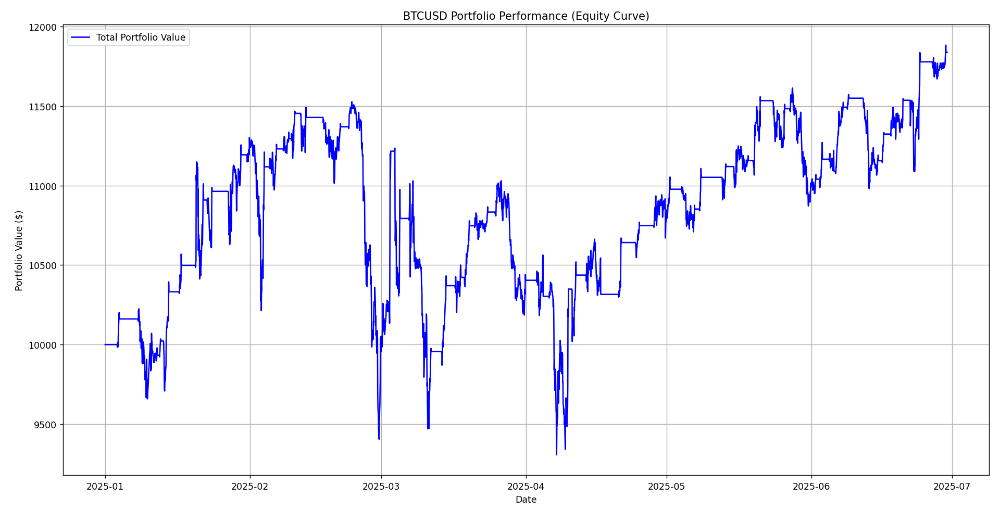
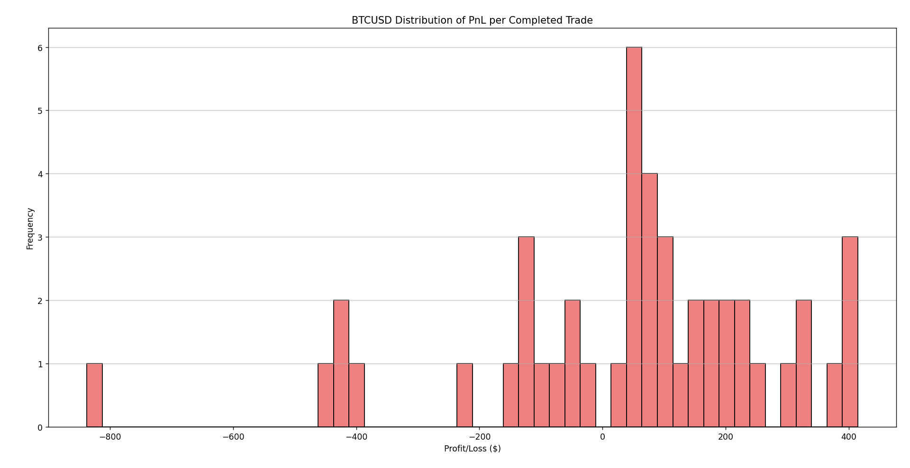
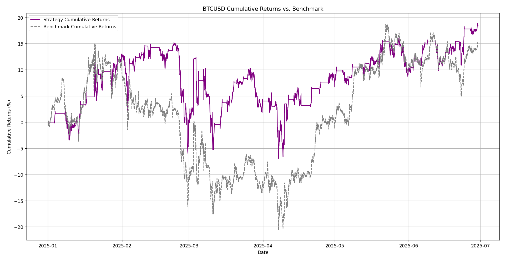
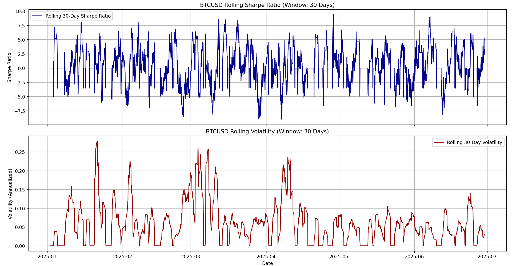
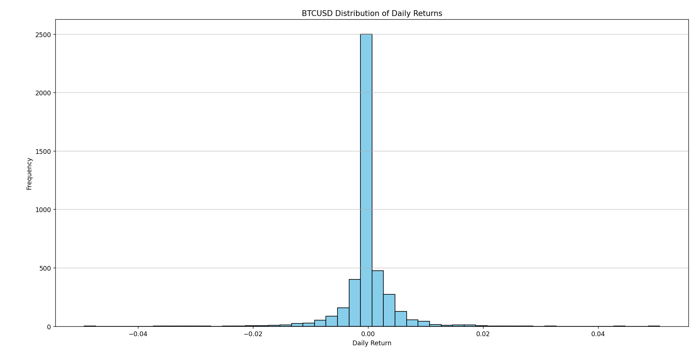

# Crypto Backtester

## Project Overview

The Crypto Backtester is a robust and flexible framework designed for backtesting quantitative trading strategies on cryptocurrency historical data. It allows users to test the profitability and performance of various trading algorithms against real market data, providing insights into their effectiveness before live deployment. The system is built with modularity in mind, making it easy to add new strategies without altering the core backtesting engine or main execution logic.

## Features

* **Modular Architecture:** Easily integrate new trading strategies by creating new Python files in the `strategies/` directory.
* **Flexible Data Handling:** Fetches historical OHLCV (Open, High, Low, Close, Volume) data for cryptocurrencies from Delta Exchange.
* **Comprehensive Backtesting Engine:** Simulates trading activity, manages portfolio state, tracks trades, and calculates profit and loss based on historical data and defined commission rates.
* **Rich Performance Metrics:** Automatically computes key performance indicators to evaluate strategy effectiveness, including:
    * Initial and Final Capital
    * Total PnL and Returns Percentage
    * Number of Trades (Buy/Sell)
    * Winning and Losing Trades
    * Win Rate
    * Average PnL per Trade
    * Maximum Drawdown
    * Sharpe Ratio
    * Sortino Ratio
    * Profit Factor
    * Expectancy
    * Up-Market and Down-Market Capture Ratios
* **Advanced Visualizations:** Generates various plots to visualize strategy performance, portfolio growth, drawdowns, trade executions, and more.
* **Configuration-driven:** All backtesting parameters, including tickers, timeframe, date ranges, initial capital, commission rates, and strategy-specific parameters, are managed via a `config.yaml` file.

## Key Performance Visualizations

Here are some visualizations from a sample backtest run:

### Price Chart with Trades and Indicators


### Portfolio Performance


### Distribution of PnL per Completed Trade


### Cumulative Returns vs. Benchmark


### Portfolio Drawdown


### Rolling Sharpe Ratio


### Distribution of Daily Returns


## Getting Started
### Prerequisites

* Python 3.8+
* `pip` package manager

### Installation

1.  **Clone the repository:**

    ```bash
    git clone [https://github.com/your-username/crypto-backtester.git](https://github.com/your-username/crypto-backtester.git)
    cd crypto-backtester
    ```

2.  **Install dependencies:**

    ```bash
    pip install -r requirements.txt
    ```
    (Note: You'll need to create a `requirements.txt` file if you don't have one. It should contain `pandas`, `numpy`, `PyYAML`, `requests`, `matplotlib`, `statsmodels`.)

    Example `requirements.txt`:
    ```
    pandas>=1.3.0
    numpy>=1.21.0
    PyYAML>=6.0
    requests>=2.26.0
    matplotlib>=3.4.3
    ```

### Configuration

Before running the backtest, you need to set up your `config/config.yaml` file.

1.  **Create `config/config.yaml`**: If it doesn't exist, create a file named `config.yaml` inside the `config/` directory.

2.  **Edit `config.yaml`**: Populate it with your desired backtesting parameters. Here's an example:

    ```yaml
    tickers:
      - BTCUSD
      # - ETHUSD # Uncomment to backtest multiple tickers
    timeframe: 1h # Supported: 1m, 5m, 15m, 30m, 1h, 4h, 1D
    start_date: 2024-01-01
    end_date: 2024-06-30
    initial_capital: 10000.0
    commission_rate: 0.001 # 0.1% per trade
    selected_strategy: Moving_Average_Crossover # Choose your strategy here
    strategy_parameters:
      Moving_Average_Crossover:
        short_window: 10
        long_window: 30
      Mean_Reversion:
        window: 20
        std_dev_multiplier: 2.0
    ```

    * `tickers`: A list of cryptocurrency pairs to backtest.
    * `timeframe`: The candlestick interval (e.g., `1h` for 1-hour candles).
    * `start_date`, `end_date`: The date range for historical data.
    * `initial_capital`: Starting capital for the backtest.
    * `commission_rate`: Transaction commission as a decimal (e.g., 0.001 for 0.1%).
    * `selected_strategy`: **Crucially, specify the name of the strategy you want to run.** This name must match a key under `strategy_parameters`.
    * `strategy_parameters`: A nested dictionary where each key corresponds to a strategy name (e.g., `Moving_Average_Crossover`) and its value is a dictionary of parameters specific to that strategy.

### Running the Backtest

Execute the `main.py` script from the root directory of the project:

```bash
python main.py
   ```

### The script will:

1. Load your configuration.

2. Fetch historical data for the specified tickers and timeframe.

3. Apply the selected strategy to generate trading signals and indicators.

4. Run the backtest simulation.

5. Print detailed performance metrics to the console.

6. Display various performance and trade visualization plots.

## Adding a New Strategy
The modular design makes adding new strategies straightforward:

1. Create a new Python file in the strategies/ directory (e.g., my_custom_strategy.py).

2. Define a class for your strategy within this file (e.g., MyCustomStrategy).

   - The class constructor (__init__) should accept data_feed and any specific parameters for your strategy.

   - It must implement a generate_signals() method. This method should:

     - Take self.data (which is a copy of the historical OHLCV data) as input.

     - Calculate all necessary indicators for your strategy.

     - Create a new pd.DataFrame (e.g., strategy_execution_data) with the same index as self.data.

     - Add the close price, a final_signal column (1 for buy, -1 for sell, 0 for hold), and all your calculated indicator columns to this strategy_execution_data DataFrame.

     - Return this strategy_execution_data DataFrame.

3. Import your new strategy into main.py.

4. Add your strategy's parameters to the strategy_parameters section in config/config.yaml under a key matching your strategy's class name (e.g., MyCustomStrategy).

5. Set selected_strategy in config.yaml to your new strategy's name.

6. If your strategy introduces new indicators you want specifically highlighted on the price chart, you might need to make minor adjustments to visualizations/plotting.py's plot_trades_on_price_chart function to check for and plot these new columns.

## Understanding Data Flow
- data_handler.py: Fetches raw OHLCV market data. Returns a standard pandas.DataFrame with open, high, low, close, volume, indexed by timestamp.

- strategies/*.py (e.g., moving_average_crossover.py):

  - Their generate_signals() method receives the historical data.

  - It calculates all specific indicators (e.g., short_ma, long_ma, upper_band, predicted_price).

  - It adds these indicator columns (along with the original close price and the final_signal) directly to a single, comprehensive DataFrame called strategy_execution_data.

  - This strategy_execution_data DataFrame is then returned.

- backtester/backtesting_engine.py:

  - Receives the strategy_execution_data DataFrame from the selected strategy.

  - Iterates through this DataFrame, row by row, simulating trades based on the final_signal and close price for the current timestamp.

  - Maintains the portfolio_history (which includes cash, units_held, holdings_value, total_value, and the close price for the benchmark) and trades DataFrames.

  - The portfolio_history will only contain portfolio state changes and the close price (and benchmark value if used). It will not contain strategy-specific indicators directly.

  - The run_backtest method returns three DataFrames: portfolio_history, trades, and strategy_execution_data.

- main.py:

  - Calls backtesting_engine.run_backtest() and unpacks the three returned DataFrames: portfolio_history, trades, and strategy_execution_data.

  - Passes portfolio_history to all performance metric calculations and generic portfolio plots (e.g., plot_cumulative_returns_vs_benchmark, plot_portfolio_performance, plot_drawdowns).

  - Passes trades to trade-related plots (e.g., plot_pnl_per_trade_distribution).

  - Passes strategy_execution_data (the one containing all indicators and the close price) to plotting.plot_trades_on_price_chart for detailed price chart visualizations with indicators.

  - main.py remains agnostic to which specific indicators are present; it just passes the data the strategy provides.

- visualizations/plotting.py:

  - Functions like plot_trades_on_price_chart (and any other plotting function that needs indicators) receive strategy_execution_data (passed as data_to_plot).

  - It uses if 'indicator_column' in data_to_plot.columns: checks to draw whichever indicator lines are present in the DataFrame it receives. This makes the plotting module inherently flexible and doesn't require modification for new indicators unless new types of plots are desired.

## Preventing Look-Ahead Bias
The system is rigorously designed to prevent look-ahead bias, a common pitfall in backtesting where future information is inadvertently used to make current trading decisions, leading to unrealistic performance:

- Sequential Data Processing: The BacktestingEngine processes data chronologically, row by row. At any given timestamp, decisions are made only using information available up to and including that specific timestamp.

- Lagged Indicator/Signal Calculation: Within the strategy files (e.g., moving_average_crossover.py, mean_reversion.py), indicators like moving averages or Bollinger Bands are calculated using rolling() functions, which only consider current and past data. Crucially, trade signals for crossovers (.shift(1)) explicitly reference values from the previous period, ensuring that a signal is generated only after the market has moved in a way that confirms the condition, not anticipating it.

- No Future Price Access: The backtesting loop ensures that when a trade is executed, the Price used for that trade is the close price of the current bar. Future prices are never accessed for decision-making or trade execution.

This strict adherence to using only past and present information ensures that the backtest accurately reflects what would have been possible in live trading.

